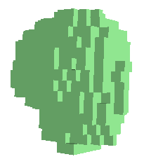
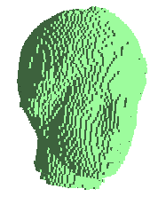
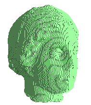
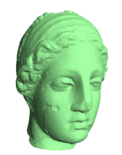

<h1 style="text-align:center">Dual Contouring Surface Extraction Algorithm</h1>


This is an implementation of the dual contouring surface extraction algorithm running on GPU.
A function is a great way to describe an arbitray shape, but it doesn't help you draw it.
To draw it you need to know the boundries of the shape. 
The Dual Contouring algorithm takes such a function ( Or a pointset : 3D scanned objects, PET scan , .. ) 
and produce  a polygonal approximation to the boundry which  then can be used for rendering. 
- In 2D the boundry would be a line. 
- In 3D the  boundry would be a mesh.
  


## Dependencies: 
- Gsl-2.6 
- Approximate Nearest Neighbors


## Prerequisites
You need to install and config [OpenGL](https://www.opengl.org/) , [GSL](https://www.gnu.org/software/gsl/) and build the [Approximate Nearest Neighbors](https://github.com/dials/annlib) module.

- Building ANN  
```console
    $ cd ann/src/ 
    $ make linux-g++
```
for other systems use ```make``` insted of ``` make linux-g++```.

- Installing Gsl 
```console
    $ wget ftp://ftp.gnu.org/gnu/gsl/gsl-2.6.tar.gz
    $ tar -zxvf gsl-2.6.tar.gz
    $ cd gsl-1.7
    $ mkdir /home/{YOUR_USERNAME}/gsl
    $ ./configure --prefix=/home/{YOUR_USERNAME}/gsl
    $ make
    $ make check 
    $ make install 
```


## Usage 
- Building the project
```console
    $ make
    $ ./main 
```

## Eperiments 
The main purpose of this project is to try to create a smooth surface mesh from a 3D scanned pointset. 

Resolution effect of the 3D surface Mesh. 


|Resolution=16           |  Resolution=64  |Resolution=128         
:-------------------------:|:-------------------------:|:-------------------------:
  |    |  

## Optimisation: 
The problem with high resolution is that it takes time to render and consume alot of computational power. For that we added a Multiresolution function that takes every tiangle in the mesh devide it into 4 triangles and project them back on the pointset and render it.
Not only we enhance the resolution , but we enhance the rendring time also. 
|Dual contouring (Res=64)            |  Multi Resolution (Res=64) 
:-------------------------:|:-------------------------:
  |    


## Limitations

Triangle intersection: Dual Contouring produces one vertex per voxel, but that vertex doesn't necessarily lay inside of the voxel. This produces potential triangle intersections, mostly at very acute angles (sharp corners). One can clamp the coordinates to the voxel. Clamping is both necessary and sufficent to ensure no intersecting triangles, but doesn't always produce quite as nice results.


